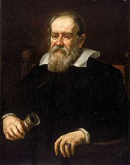

<table class="infobox biography vcard">
<tbody>
<tr>
<th colspan="2">

Galileo Galilei

</th>
</tr>
<tr>
<td colspan="2">

1636 portrait by&nbsp;<a title="Justus Sustermans" href="https://en.wikipedia.org/wiki/Justus_Sustermans">Justus Sustermans</a>

</td>
</tr>
<tr>
<th scope="row">Born</th>
<td>

Galileo di Vincenzo Bonaiuti de' Galilei

 15 February 1564 

<a title="Pisa" href="https://en.wikipedia.org/wiki/Pisa">Pisa</a>,&nbsp;<a title="Duchy of Florence" href="https://en.wikipedia.org/wiki/Duchy_of_Florence">Duchy of Florence</a>

</td>
</tr>
<tr>
<th scope="row">Died</th>
<td>8 January 1642&nbsp;(aged&nbsp;77) 

<a title="Arcetri" href="https://en.wikipedia.org/wiki/Arcetri">Arcetri</a>,&nbsp;<a title="Grand Duchy of Tuscany" href="https://en.wikipedia.org/wiki/Grand_Duchy_of_Tuscany">Grand Duchy of Tuscany</a>

</td>
</tr>
<tr>
<th scope="row">Education</th>
<td><a title="University of Pisa" href="https://en.wikipedia.org/wiki/University_of_Pisa">University of Pisa</a></td>
</tr>
<tr>
<th scope="row">Known&nbsp;for</th>
<td><a title="Analytical dynamics" href="https://en.wikipedia.org/wiki/Analytical_dynamics">Analytical dynamics</a>,&nbsp;<a title="Heliocentrism" href="https://en.wikipedia.org/wiki/Heliocentrism">heliocentrism</a>,&nbsp;<a title="Kinematics" href="https://en.wikipedia.org/wiki/Kinematics">kinematics</a>,&nbsp;<a title="Observational astronomy" href="https://en.wikipedia.org/wiki/Observational_astronomy">observational astronomy</a></td>
</tr>
<tr>
<td colspan="2"><strong>Scientific career</strong></td>
</tr>
<tr>
<th scope="row">Fields</th>
<td class="category"><a title="Astronomy" href="https://en.wikipedia.org/wiki/Astronomy">Astronomy</a>,&nbsp;<a title="Physics" href="https://en.wikipedia.org/wiki/Physics">physics</a>,&nbsp;<a title="Engineering" href="https://en.wikipedia.org/wiki/Engineering">engineering</a>,&nbsp;<a title="Natural philosophy" href="https://en.wikipedia.org/wiki/Natural_philosophy">natural philosophy</a>,&nbsp;<a title="Mathematics" href="https://en.wikipedia.org/wiki/Mathematics">mathematics</a></td>
</tr>
<tr>
<th scope="row">Institutions</th>
<td>

<ul>
<li><a title="University of Pisa" href="https://en.wikipedia.org/wiki/University_of_Pisa">University of Pisa</a></li>
<li><a title="University of Padua" href="https://en.wikipedia.org/wiki/University_of_Padua">University of Padua</a></li>
</ul>

</td>
</tr>
<tr class="note">
<th scope="row">Patrons</th>
<td>

<ul>
<li><a class="mw-redirect" title="Cosimo II de Medici" href="https://en.wikipedia.org/wiki/Cosimo_II_de_Medici">Cosimo II de Medici</a></li>
<li><a title="Federico Cesi" href="https://en.wikipedia.org/wiki/Federico_Cesi">Federico Cesi</a></li>
<li><a class="mw-redirect" title="Ferdinando II de Medici" href="https://en.wikipedia.org/wiki/Ferdinando_II_de_Medici">Ferdinando II de Medici</a></li>
<li><a class="mw-redirect" title="Fra Paolo Sarpi" href="https://en.wikipedia.org/wiki/Fra_Paolo_Sarpi">Fra Paolo Sarpi</a></li>
<li><a title="Francesco Maria del Monte" href="https://en.wikipedia.org/wiki/Francesco_Maria_del_Monte">Francesco Maria del Monte</a></li>
</ul>

</td>
</tr>
<tr>
<th scope="row">Academic advisors</th>
<td><a class="mw-redirect" title="Ostilio Ricci da Fermo" href="https://en.wikipedia.org/wiki/Ostilio_Ricci_da_Fermo">Ostilio Ricci da Fermo</a></td>
</tr>
<tr>
<th scope="row">Notable students</th>
<td>

<ul>
<li><a title="Benedetto Castelli" href="https://en.wikipedia.org/wiki/Benedetto_Castelli">Benedetto Castelli</a></li>
<li><a title="Mario Guiducci" href="https://en.wikipedia.org/wiki/Mario_Guiducci">Mario Guiducci</a></li>
<li><a title="Vincenzo Viviani" href="https://en.wikipedia.org/wiki/Vincenzo_Viviani">Vincenzo Viviani</a></li>
</ul>

</td>
</tr>
<tr>
<th colspan="2">Signature</th>
</tr>
<tr>
<td colspan="2"></td>
</tr>
</tbody>
</table>
 

<strong>Galileo di Vincenzo Bonaiuti de' Galilei</strong>&nbsp;(15 February 1564&nbsp;&ndash; 8 January 1642) was an Italian&nbsp;<a title="Astronomer" href="https://en.wikipedia.org/wiki/Astronomer">astronomer</a>,&nbsp;<a title="Physicist" href="https://en.wikipedia.org/wiki/Physicist">physicist</a>&nbsp;and&nbsp;<a title="Engineer" href="https://en.wikipedia.org/wiki/Engineer">engineer</a>, sometimes described as a&nbsp;<a title="Polymath" href="https://en.wikipedia.org/wiki/Polymath">polymath</a>, from&nbsp;<a title="Pisa" href="https://en.wikipedia.org/wiki/Pisa">Pisa</a>.&nbsp;Galileo has been called the "father of&nbsp;<a title="Observational astronomy" href="https://en.wikipedia.org/wiki/Observational_astronomy">observational astronomy</a>",&nbsp;the "father of modern physics",&nbsp;the "father of the&nbsp;<a title="Scientific method" href="https://en.wikipedia.org/wiki/Scientific_method">scientific method</a>",&nbsp;and the "father of&nbsp;<a class="mw-redirect" title="Modern science" href="https://en.wikipedia.org/wiki/Modern_science">modern science</a>".

Galileo studied&nbsp;<a title="Speed" href="https://en.wikipedia.org/wiki/Speed">speed</a>&nbsp;and&nbsp;<a title="Velocity" href="https://en.wikipedia.org/wiki/Velocity">velocity</a>,&nbsp;<a title="Gravity" href="https://en.wikipedia.org/wiki/Gravity">gravity</a>&nbsp;and&nbsp;<a title="Free fall" href="https://en.wikipedia.org/wiki/Free_fall">free fall</a>, the&nbsp;<a title="Principle of relativity" href="https://en.wikipedia.org/wiki/Principle_of_relativity">principle of relativity</a>,&nbsp;<a title="Inertia" href="https://en.wikipedia.org/wiki/Inertia">inertia</a>,&nbsp;<a title="Projectile motion" href="https://en.wikipedia.org/wiki/Projectile_motion">projectile motion</a>&nbsp;and also worked in applied science and technology, describing the properties of&nbsp;<a class="mw-redirect" title="Pendulums" href="https://en.wikipedia.org/wiki/Pendulums">pendulums</a>&nbsp;and "<a class="mw-redirect" title="Hydrostatic" href="https://en.wikipedia.org/wiki/Hydrostatic">hydrostatic</a>&nbsp;balances". He invented the&nbsp;<a title="Thermoscope" href="https://en.wikipedia.org/wiki/Thermoscope">thermoscope</a>&nbsp;and various&nbsp;<a title="Sector (instrument)" href="https://en.wikipedia.org/wiki/Sector_(instrument)">military compasses</a>, and used the&nbsp;<a title="Telescope" href="https://en.wikipedia.org/wiki/Telescope">telescope</a>&nbsp;for scientific observations of celestial objects. His contributions to observational astronomy include the telescopic confirmation of the&nbsp;<a title="Phases of Venus" href="https://en.wikipedia.org/wiki/Phases_of_Venus">phases of Venus</a>, the observation of the&nbsp;<a class="mw-redirect" title="Galilean Moons" href="https://en.wikipedia.org/wiki/Galilean_Moons">four largest satellites</a>&nbsp;of&nbsp;<a title="Jupiter" href="https://en.wikipedia.org/wiki/Jupiter">Jupiter</a>, the observation of&nbsp;<a class="mw-redirect" title="Saturn's rings" href="https://en.wikipedia.org/wiki/Saturn%27s_rings">Saturn's rings</a>, and the analysis of&nbsp;<a class="mw-redirect" title="Sunspots" href="https://en.wikipedia.org/wiki/Sunspots">sunspots</a>.

Galileo's championing of&nbsp;<a title="Heliocentrism" href="https://en.wikipedia.org/wiki/Heliocentrism">heliocentrism</a>&nbsp;and&nbsp;<a title="Copernican heliocentrism" href="https://en.wikipedia.org/wiki/Copernican_heliocentrism">Copernicanism</a>&nbsp;met with opposition from within the Catholic Church and from some astronomers. The matter was investigated by the&nbsp;<a title="Roman Inquisition" href="https://en.wikipedia.org/wiki/Roman_Inquisition">Roman Inquisition</a>&nbsp;in 1615, which concluded that heliocentrism was "foolish and absurd in philosophy, and formally heretical since it explicitly contradicts in many places the sense of Holy Scripture".

Galileo later defended his views in&nbsp;<em><a title="Dialogue Concerning the Two Chief World Systems" href="https://en.wikipedia.org/wiki/Dialogue_Concerning_the_Two_Chief_World_Systems">Dialogue Concerning the Two Chief World Systems</a></em>&nbsp;(1632), which appeared to attack&nbsp;<a title="Pope Urban VIII" href="https://en.wikipedia.org/wiki/Pope_Urban_VIII">Pope Urban VIII</a>&nbsp;and thus alienated both the Pope and the&nbsp;<a class="mw-redirect" title="Jesuits" href="https://en.wikipedia.org/wiki/Jesuits">Jesuits</a>, who had both supported Galileo up until this point.&nbsp;He was tried by the Inquisition, found "vehemently suspect of heresy", and forced to recant. He spent the rest of his life under house arrest.&nbsp;During this time, he wrote&nbsp;<em><a title="Two New Sciences" href="https://en.wikipedia.org/wiki/Two_New_Sciences">Two New Sciences</a></em>&nbsp;(1638), primarily concerning&nbsp;<a title="Kinematics" href="https://en.wikipedia.org/wiki/Kinematics">kinematics</a>&nbsp;and the&nbsp;<a title="Strength of materials" href="https://en.wikipedia.org/wiki/Strength_of_materials">strength of materials</a>, summarizing work he had done some forty years earlier.

 

<strong> Publications: </strong>

<ul>

 <li><a target="_blank" href="https://github.com/manjunath5496/Galileo-Galilei-Publications/blob/master/tst(128).pdf" style="text-decoration:none;">Two New Sciences</a></li>
                            
 <li><a target="_blank" href="https://github.com/manjunath5496/Galileo-Galilei-Publications/blob/master/tst(129).pdf" style="text-decoration:none;">Discoveries and opinions of Galileo</a></li>
 <li><a target="_blank" href="https://github.com/manjunath5496/Galileo-Galilei-Publications/blob/master/tst(130).pdf" style="text-decoration:none;">Delphi Collected Works of Galileo Galilei</a></li>
                            
 <li><a target="_blank" href="https://github.com/manjunath5496/Galileo-Galilei-Publications/blob/master/tst(131).pdf" style="text-decoration:none;">Dialogue Concerning the Two Chief World Systems</a></li>
 
  <li><a target="_blank" href="https://github.com/manjunath5496/Galileo-Galilei-Publications/blob/master/tst(132).pdf" style="text-decoration:none;">The Assayer</a></li>
                            
 <li><a target="_blank" href="https://github.com/manjunath5496/Galileo-Galilei-Publications/blob/master/tst(133).pdf" style="text-decoration:none;">On Sunspots</a></li>
 
  <li><a target="_blank" href="https://github.com/manjunath5496/Galileo-Galilei-Publications/blob/master/tst(134).pdf" style="text-decoration:none;">The Sidereal Messenger</a></li>
                           
</ul>

 
